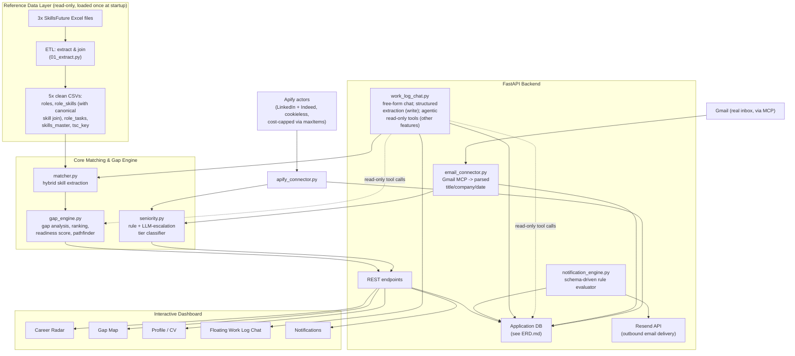

# Architecture

**Status legend used throughout:** ✅ Built & tested · 🔧 Designed, not yet built · 🔮 Roadmap (out of hackathon scope)

---

## 0. Tech Stack

| Layer | Choice | Rationale |
|---|---|---|
| Backend | Python + FastAPI | PyCon's own constraint; typed request/response models for fast, self-documenting iteration; async support for LLM/chat calls |
| Frontend | React, chat-first (single conversational interface as the primary surface; inline-rendered charts/cards for Career Radar and Gap Map content, not separate dashboard pages — see section 2.10) + Recharts for inline chart rendering | The hackathon's actual judging criteria require an interactive solution grounded in the datasets, not specifically a multi-page dashboard (confirmed by re-reading the published criteria mid-project — see DECISIONS.md); a chat-first interface makes every tool call (Gmail search, Apify search, matcher, gap engine) visibly part of one coherent agentic flow, which plays well to the Execution and User Focus criteria |
| Database | PostgreSQL, hosted on Supabase (database only — see section 2.9 on why Supabase's auth product is deliberately NOT used) | The ERD is genuinely relational (FKs across `SavedJob`, `WorkLogEntry`, `SKILL_MATCH_CACHE`, notification tables); a managed Postgres instance removes hosting setup time under hackathon deadline pressure |
| Fuzzy matching | `rapidfuzz` | Skill matching (section 2.2) and JD-to-spotted-entry merge matching (section 2.5) — deterministic, explainable, no API cost |
| LLM | **Provider-agnostic** — Claude (primary/default, used throughout design and development) via the plain `anthropic` Python SDK, with OpenAI (explicitly-supported deployment alternate) via the `openai-agents` SDK, behind one abstraction layer (see section 2.11 for why these specific libraries — not `claude-agent-sdk` or OpenAI's now-deprecated Agent Builder — were chosen) | Seniority Tier-2 escalation, Work Log/JD-paste structured extraction, agentic read-tool chat — always constrained/structured output, never open-ended generation disconnected from real data (see sections 2.5 and 2.11) |
| Auth | Self-implemented Google OAuth2 (`google-auth-oauthlib`), optional | See section 2.9 |
| Notification delivery | Resend (3,000 emails/month free, permanent — confirmed via direct research; not Clerk, which is an auth platform without a general notification-sending API, and not SendGrid, whose free tier is now a time-limited 60-day trial rather than permanent) | Notifications are real emails, not an in-app surface — see section 2.6 |

## 1. System Overview



---

## 2. Component Detail

### 2.1 Reference Data Layer ✅

**Source files** (all from the public SkillsFuture Jobs-Skills Portal — see PRD.md / form
"Datasets used" answer for rationale):
- `jobsandskills-skillsfuture-skills-framework-dataset.xlsx` — 6 sheets: job role descriptions,
  critical work functions/key tasks, role-to-skill mapping with proficiency levels, and the
  TSC/CCS key/description tables.
- `jobsandskills-skillsfuture-tsc-to-unique-skills-mapping.xlsx` — bridges sector-specific skill
  codes to a normalized "unique skill" vocabulary, enabling cross-sector comparison (a skill
  named slightly differently in ICT vs Financial Services resolves to one canonical title).
- `jobsandskills-skillsfuture-unique-skills-list.xlsx` — canonical skill dictionary with
  `is_emerging` / `is_casl` flags (SkillsFuture's own forward-looking demand signal).

**Why three files, not one:** the join chain `Job Role_TCS_CCS.TSC_CCS Code → TSC_CCS_Key.TSC
Code → mapping.skills_framework_skill_code → Unique Skills List.skill_title` is what makes
matching robust across all 39 sectors instead of being ICT-only. This was validated end-to-end
during the build: 44,172 of 44,172 TSC skill instances resolved to a canonical title with zero
unmatched rows.

**ETL output:** 5 flat CSVs, regenerated by a one-time extraction script. The app loads these at
startup rather than parsing the 13MB source Excel file per request.

### 2.2 Matcher (`matcher.py`) ✅

Hybrid, three-tier matching from free text → canonical SkillsFuture skill titles:

1. **Exact phrase match** — word-boundary-safe regex; single-word skill titles (e.g.
   "Research", "Cutting", "Influence" — real canonical titles that are also common English
   words) require capitalized usage in the original text to reduce false positives from casual
   sentence usage.
2. **Synonym layer** — ~100 hand-curated, individually-verified mappings from
   tools/languages/frameworks (Python, AWS, Kubernetes, LangChain, etc.) to the canonical
   capability-level skill they represent. Necessary because the SkillsFuture taxonomy is
   deliberately tool-agnostic (it describes "Cloud Computing Implementation," not "AWS") so it
   doesn't go stale as specific tools change. Every target skill name in this dictionary is
   checked programmatically against `skills_master.csv` — no invented skill names ship.
3. **Conservative fuzzy match** — `rapidfuzz.token_sort_ratio`, threshold 94, comparing
   text windows length-matched to the candidate title's word count. Tuned specifically to avoid
   two found-in-testing failure modes: (a) `token_set_ratio` scoring subset matches as 100%
   (e.g. "change management" wrongly matching "Organisational Change Management" at 100%), and
   (b) low-threshold matches conflating near-miss-but-distinct words ("change" vs "channel",
   "project" vs "product").
4. **LLM fallback** 🔧 — for text that produces zero/low-confidence matches, escalate to an LLM
   call constrained to return only skills from the canonical list (not free-form), to control
   for the matcher's main known gap: bare tool/language mentions without surrounding context.

Every match returned carries `method`, `confidence`, and `evidence` (the literal text that
triggered it) — this is the basis for the "explain why" requirement throughout the product.

**⚠️ Note for whoever implements this from scratch (no original code is being transferred —
this section is a description of validated *behavior*, not a spec of exact library calls or
threshold values to copy blindly):**

The specific numbers above (e.g. fuzzy threshold 94, `rapidfuzz.token_sort_ratio`) were *our*
tuned result for *our* specific test inputs, not a requirement. A different implementation may
reasonably use different libraries or thresholds. What matters is that the resulting matcher is
tested against these **specific failure modes we actually hit** during the build, since they're
non-obvious and easy to reintroduce silently:

1. **Subset/superset false matches.** Any fuzzy scorer that ignores length difference (e.g.
   naive use of `token_set_ratio` or similar set-based scorers) will score a short phrase as a
   ~100% match against a longer title that contains all its words — e.g. text containing "change
   management" will falsely match "Organisational Change Management" or "Climate Change
   Management" at full confidence, even though these are different, more specific skills than
   what was actually written. **Test:** feed in a generic 2-word phrase and confirm it does NOT
   match every longer title that happens to contain those two words.

2. **Near-miss-but-distinct words scoring dangerously high.** Single-character-different words
   with unrelated meanings ("change" vs "channel", "project" vs "product") can score 88-91% on
   common fuzzy ratios — high enough to clear a casually-chosen threshold. **Test:** explicitly
   check word pairs like these and confirm your chosen threshold rejects them; don't pick a
   threshold from a single happy-path example.

3. **Common-English-word skill titles causing noise.** The canonical skill list contains
   single-word titles that are also everyday English words (e.g. "Research", "Cutting",
   "Influence", "Documentation", "Networking" — there were 36 such titles found in the dataset
   used during this build). Naive exact/substring matching will fire on these constantly in
   normal prose (e.g. "we do cutting-edge research"). **Test:** run the matcher against a
   paragraph of generic business writing that does NOT describe any real skill, and confirm it
   does not return a long list of unrelated single-word matches. Consider requiring a stronger
   signal for single-word titles than for multi-word ones (e.g. capitalization, a skills-list
   context, or excluding them from fuzzy matching entirely).

4. **Substring matches inside unrelated words.** Naive `in` / substring checks (rather than
   word-boundary-aware regex) will match short skill titles or synonym keys *inside* unrelated
   longer words — e.g. a check for "aws" matching inside the word "l**aws**". **Test:** confirm
   short keyword matches respect word boundaries.

5. **Invented/unverified canonical skill names.** It's easy to write a synonym dictionary
   (mapping tool names like "Kubernetes" or "Terraform" to a capability-level skill) using
   plausible-sounding but non-existent target skill titles, especially when guessing at a
   government taxonomy's naming conventions before inspecting the real data closely (e.g.
   assuming a skill is called "Cloud Computing Implementation" or "Web Development" without
   checking). **Test:** programmatically verify every synonym target string exists exactly in
   `skills_master.csv` (or your equivalent canonical list) before shipping the dictionary — do
   this as an automated check, not a one-time manual read-through, since the dictionary is
   likely to grow over time.

### 2.3 Gap Engine (`gap_engine.py`) ✅

- `analyze_jd_vs_cv` — per-JD have/missing skill split.
- `aggregate_demand` — across all saved JDs, counts how often each missing skill is demanded
  (signal strength).
- `rank_action_list` — priority score = signal strength (fraction of JDs demanding it) +
  emerging-skill bonus + CASL-priority bonus. Returns a capped, ranked top-N list with a
  plain-language reason per item — directly implements the brief's "actionable pathways
  instead of overwhelming skill sets." **Extension, not yet implemented or tested (🔧):** an
  `interest_level` weighting term (see section 2.13) is planned on top of this already-validated
  scoring formula — a missing skill that blocks a `high`-interest job should outrank the same
  skill appearing only in `low`-interest spotted entries. This extension must be validated with
  its own test cases once built, the same way the existing signal-strength/emerging-bonus
  formula was validated against real saved-JD data during this build — it should not be assumed
  to work correctly just because it slots into an already-tested function.
- `find_closest_roles` — Career Pathfinder. Ranks SkillsFuture roles by **overlap count**, not
  raw overlap percentage, with a minimum required-skill-count filter. This was a deliberate fix
  during build: percentage-of-required is biased toward roles with very few listed skills (a
  2-skill role hits 50% from one lucky match), which produced nonsensical top results
  (e.g. a niche 5-skill media role outranking genuinely close roles like "Back End Developer").
  Ranking by absolute overlap count, with a floor on role skill-list size, fixed this.
- `readiness_score` — average % of each saved JD's requirements already evidenced; designed to
  be re-run periodically and tracked as a trend (Career Radar Chart A/B context).

### 2.4 Seniority Classifier (`seniority.py`) 🔧

Two-tier design:
- **Tier 1 (rule-based):** keyword pattern match on job title (intern/junior/associate →
  entry; senior/sr./specialist → senior; staff/principal/architect → staff_principal;
  manager/director/head/chief/VP → manager_plus as a distinct axis from IC seniority). Fast,
  free, and the result the UI shows by default with the matched keyword as its own explanation.
- **Tier 2 (LLM escalation):** triggered only when Tier 1 produces no confident signal (e.g.
  "Digital Asset Technical Analyst", or titles where a keyword is present but contextually
  misleading, like "Junior Client Python Developer" at a financial data company being a
  client-facing consulting role rather than a typical junior engineering role). The LLM call is
  constrained to pick exactly one of the fixed tier values and must return one sentence of
  reasoning, which is stored (`seniority_reasoning`) so even LLM-tier classifications remain
  inspectable rather than opaque.

### 2.5 Work Log Chat (`work_log_chat.py`) 🔧 — agentic, read-only across features, plus JD paste-and-parse

Free-form conversational surface with **three distinct capabilities**, all built on the same
underlying pattern (free-form input, constrained structured-output extraction underneath):

1. **Work Log extraction** (write) — describing recent work creates new `WorkLogEntry` rows.
2. **Agentic read-only Q&A** (no write) — querying other features' data via tool calls.
3. **JD paste-and-parse** (write) — pasting a full job description gets parsed into a complete
   `SavedJob` record.

**1. Work Log extraction, per turn:**
1. The visible chat reply is conversational/natural.
2. A parallel/sequential constrained call extracts a fixed schema (skills mentioned, neutral
   activity summary, seniority signal, confidence, whether a follow-up question is needed).
3. `skills_mentioned` is run through the **same** `matcher.py` used for CV/JD text — this is a
   deliberate architectural choice so the Work Log doesn't become a second, inconsistent
   skill-extraction pathway.
4. Low-confidence extractions trigger an in-chat clarifying question rather than being silently
   recorded — avoids the failure mode of confidently logging a vague, low-signal entry.

**2. Agentic read-only tool use across features:** the chat is given a fixed set of read-only
tools, each a thin wrapper around a function the dashboard pages already call — so a person can
ask things like "which of my saved jobs am I most ready for right now?" or "what's my biggest
skill gap?" conversationally, and the agent decides which tool(s) to call and composes the
answer from the real returned data.

| Tool | Wraps | Returns |
|---|---|---|
| `get_readiness_score()` | `gap_engine.readiness_score` | overall %, per-JD breakdown |
| `get_top_skill_gaps(horizon_filter?)` | `gap_engine.rank_action_list` | ranked, capped, explained gaps |
| `get_closest_roles()` | `gap_engine.find_closest_roles` | Career Pathfinder results |
| `get_saved_jobs(filter?)` | `SavedJob` query | title/company/seniority/date list |
| `get_cv_skills()` | `UserProfile` skill cache | current evidenced skills |
| `get_recent_work_log(period?)` | `WorkLogEntry` query | recent self-reported activity |
| `get_notifications(unread_only?)` | `Notification` query | active alerts |

**Why this preserves explainability, not just convenience:** because every tool wraps a function
the dashboard pages themselves use, an answer given in chat is traceable to the exact same
ranked-list-with-reasons or readiness-score-breakdown a person would see by navigating to that
page directly — the chat is a second surface onto one source of truth, not a separate,
less-grounded way of answering the same question.

**3. JD paste-and-parse:** this exists specifically because the Email Connector (section 2.8)
can only ever surface title/company/location/date — never the full JD body (a confirmed,
tested limitation of LinkedIn's alert email format). Pasting the full text into the chat is how
a lightweight "spotted" entry becomes a fully analyzable one.

Per pasted JD:
1. A constrained extraction call parses the pasted text into: `company`, `title`,
   `seniority_tier` + `seniority_reasoning` (reusing the seniority classifier from section 2.4),
   and `extracted_skills` (reusing `matcher.py`, same as every other text source in this
   system).
2. If an expected field (most commonly `company`, since pasted text sometimes omits letterhead/
   header context) isn't clearly present, the chat asks for confirmation rather than silently
   writing a blank or guessed value.
3. **Duplicate/merge check against existing "spotted" entries:** before creating a new
   `SavedJob` row, the parsed `(company, title)` pair is fuzzy-matched (via the same `rapidfuzz`
   library used in `matcher.py`, applied to these two fields specifically — note this requires
   its own threshold tuning, not a reused skill-matching threshold, since "Software Engineer"
   vs. "Senior Software Engineer" needs to score as *related but distinct*, not as a duplicate)
   against existing source=`linkedin_email` (or other email-sourced) entries that don't yet have
   `raw_jd_text`. If exactly one strong match is found, the chat asks: *"This looks like the
   [title] at [company] role spotted on [date] — attach this description to that entry instead
   of creating a new one?"* The merge only happens on explicit confirmation. If there are
   multiple candidate matches, or none clear enough, a new entry is created without prompting a
   merge — **ambiguous matches are never auto-resolved**, consistent with this project's
   established pattern (the seniority classifier's LLM-escalation design follows the same
   "surface uncertainty for a decision, don't silently resolve it" principle).

**The complete write boundary, stated precisely:** the chat can create new `WorkLogEntry` rows
(capability 1) and new (or merged, with confirmation) `SavedJob` rows (capability 3). It cannot
modify `UserProfile`, `Notification`, or any *existing* `SavedJob` row other than via the
explicit, confirmed merge path in capability 3. None of the read-only tools in capability 2 can
write anything, under any circumstance — that boundary is enforced at the tool-definition level
(those functions are simply not exposed as write-capable), not by prompting the model to behave.
A write-capable agent for *other* mutations (e.g. "update my CV," "dismiss that notification,"
directly from chat) remains a 🔮 roadmap item, not silently dropped — this was a scoping
decision made explicitly, to keep the live-demo failure surface smaller while still delivering
the core value of one conversational surface aware of (and now also able to populate) the rest
of the system.

**Reliability note (named honestly, not glossed over):** structured-output extraction from an
LLM can fail to parse, and tool-selection in an agentic flow can occasionally call the wrong
tool or none at all for an ambiguous question. The implementation needs defensive parsing with a
retry path (extraction, both for Work Log and JD-paste) and a sensible fallback response when no
tool clearly fits (agentic read path), so a single malformed response or a missed tool-call
doesn't break the demo. This is a known risk explicitly tracked, not an afterthought.

### 2.6 Notification Engine (`notification_engine.py`) 🔧 — delivered via email (Resend), not an in-app surface

**Applied directly from PyCon SG 2026 Day 2's talk** ("Building a Flexible and Scalable
Notification System," GyeongSeon Park, Kakaobank) — see PRD.md and the form's "what did you
learn / how applied" answer. Core idea adopted: **rules live in the schema, not the codebase.**

- `NotificationRule` rows define a `trigger_type`, a human-readable condition, and a template —
  adding a new alert type is an inserted row, not a code change, mirroring the talk's "ops team
  added their own notifications within a day" result.
- A single generic evaluator function iterates all active rules and dispatches to a small
  per-`trigger_type` Python condition-check (this hackathon build doesn't implement the talk's
  SQL-query-as-data mechanism literally — given the much smaller rule count and Python-native
  data access here, condition logic is a Python function keyed by `trigger_type` rather than a
  stored SQL string — but the schema-driven *rule definition and dedup* pattern is preserved
  faithfully).
- `NotificationRuleState.last_fired_at` is the dedup guard, directly addressing the talk's
  opening hook about duplicate-send bugs from copy-pasted dedup logic — by centralizing dedup
  state in one table read by the one evaluator, instead of per-job-type ad hoc logic.
- Hackathon-scope simplification: no real cron/Airflow. The evaluator is invoked on-demand
  (e.g. at the start of a conversation, or a manual "check for updates" request to the agent)
  rather than on a real schedule — documented as the scoped-down piece, with real scheduling
  named as a 🔮 roadmap item.

**Delivery mechanism: outbound email via Resend, deliberately NOT an in-app notification
surface.** This was a direct, explicit product decision (see DECISIONS.md) — notifications are
real emails sent to the person's address, not items in a panel inside the application that they
have to remember to check. This is consistent with the project's underlying goal (PRD.md
section 1): the whole point is to *avoid* requiring the person to remember to look at something.

- **Why Resend, not Clerk:** Clerk was the person's first suggestion, but it is an
  identity/auth platform, not a notification-delivery service — its email-sending capability is
  built specifically around auth-flow templates (verification codes, magic links) rendered and
  sent through its own system, with no general-purpose API for sending arbitrary application
  notifications. Adopting Clerk for this would have repeated the same category error this
  project already corrected once before (section 2.9: choosing an identity platform for a
  problem it isn't built to solve).
- **Why Resend over SendGrid:** SendGrid was the second option considered. Direct research
  confirmed SendGrid's free plan was retired (May 2025) in favor of a 60-day trial after which a
  paid plan (from $19.95/mo) is required — workable for the hackathon's own build/demo window,
  but not actually free on an ongoing basis. Resend's free tier (3,000 emails/month) has no
  expiration, which matters since the deployed app may continue to exist and be reviewed after
  the hackathon's own 60-day mark.
- **Sending mechanism:** Resend sends on behalf of the application using the application's own
  API key — it does **not** require any per-user OAuth grant, unlike the Email *Reading*
  Connector (section 2.8, which uses Gmail OAuth specifically to search a person's inbox). These
  are two structurally distinct mechanisms that happen to both involve email: one reads from a
  person's Gmail with their explicit per-user authorization; the other sends *to* an address
  the application already has (see ERD.md's note on `USER_PROFILE.notification_email`).
- **Honest edge case, stated directly (per ERD.md):** since auth is optional (section 2.9), a
  person who never connects Gmail has no known `notification_email` on file. The notification
  evaluator must skip sending in this case rather than fail or invent an address — this means
  notifications are only deliverable to people who have connected an account, which is a real
  limitation of the optional-auth design, not a bug to be silently patched around.

### 2.7 FastAPI Backend 🔧

Chosen over Flask for: native typed request/response models (self-documenting data contracts
under hackathon time pressure), auto-generated OpenAPI docs (useful if judges want to inspect
the API directly), and async support if the LLM fallback/chat calls need to be non-blocking.

### 2.8 Email Connector (`email_connector.py`) ✅ *(parsing logic tested against live inbox)* 🔧 *(OAuth deployment wiring)*

**Product motivation, stated first because it drives the design choice, not just a technical
constraint worked around:** LinkedIn and Indeed each run their own recommendation algorithms to
decide which postings to surface to a given person via job-alert emails — those emails are
already the distilled output of a system that has filtered an enormous pool of postings down to
what that platform's model judges relevant to this specific person. This connector is built to
deliberately inherit that curation, rather than attempting to reimplement a weaker version of
LinkedIn's or Indeed's own recommendation quality from scratch. The fact that LinkedIn's
Developer API cannot expose a user's saved/alerted job details (confirmed earlier in this
project) reinforces email as the right access path, but it is not the primary reason this
design was chosen — the primary reason is wanting the recommendation quality those companies
have already built, not working around their absence.

**The core search/parse logic is real and tested** — validated during the build by directly
querying a real Gmail inbox via the Gmail API/MCP connector, not designed against assumptions.
**The deployed app's OAuth flow is designed but not yet wired** — see breakdown below.

**Privacy boundary (important, drives the deployment design):** the project author's personal
Gmail is never connected to the deployed application at any point. The deployed app implements a
**generic OAuth2 flow** — when *any* user (a reviewer, the author, anyone) clicks "Connect your
Gmail," they are sent through Google's standard consent screen and authorize **their own**
Google account. The resulting access/refresh token is scoped to that user's session only. The
author's own validation testing (described below) was done locally against the author's account
during development and is not part of the deployed app's runtime path.

**Mechanism (parsing logic — tested):**
- `Gmail.search_threads` filtered to job-alert sender addresses: confirmed real for LinkedIn
  (`jobalerts-noreply@linkedin.com`, `jobs-noreply@linkedin.com`); Glassdoor and Indeed sender
  addresses and digest formats are implemented by analogy and should be verified against real
  sample emails from those providers before being trusted to the same degree as the LinkedIn
  path (flagged honestly in PRD.md section 8 — not claimed as equally validated).
- `Gmail.get_thread` (FULL_CONTENT) retrieves the plaintext body of each matched thread.
- A dedicated parser (`parse_digest_email`) splits the body on the provider's fixed separator
  pattern and extracts `{title, company, location}` per chunk.
- An explicit navigation/footer filter excludes non-job chunks that share the same
  line-structure (e.g. "See all jobs on LinkedIn", "View all jobs", "Expand your search", the
  legal footer) — found and fixed during testing against real LinkedIn emails; without it,
  these are parsed as false "jobs."
- The email's `date` header becomes `SavedJob.date_saved` — a real server timestamp, more
  reliable than a manually-noted date.

**Mechanism (OAuth deployment — to be wired):**
- Standard OAuth2 authorization code flow against Google's identity endpoints, requesting the
  `gmail.readonly` scope only (least privilege — read-only search/fetch, no send/delete/modify).
- Client ID/Secret registered in Google Cloud Console for this project; redirect URI set to the
  deployed app's callback route.
- **Credentials handling:** Client Secret stored as a deployment environment variable / secrets
  manager entry, never committed to the (public) repo. Per-user access/refresh tokens stored
  server-side, scoped to that user's session, never logged, never shared across users.
- **Unverified app disclosure:** since Google's app-verification process was not pursued given
  the hackathon timeline, the consent screen will show an "unverified app" warning. The deployed
  UI states this explicitly before the user clicks through, naming the exact scope requested, so
  a cautious reviewer can make an informed choice rather than encountering the warning
  unexplained.
- **Default view:** a synthetic, clearly-labeled sample dataset (structurally modeled on the
  real LinkedIn format discovered during testing, plus analogous Glassdoor/Indeed examples) is
  shown before any account is connected, so reviewers who decline to connect anything still see
  the feature's output shape.

**Honest, load-bearing limitation (confirmed by direct inspection for LinkedIn, not assumed):**
the email body contains only title, company, location, and a tracking link per job — **never**
the actual job description (responsibilities/requirements). Clicking through to the real
posting requires the job board's own login, which hits the same wall as the LinkedIn Developer
API (which also cannot expose a user's saved/alerted job details). The connector's scope was
deliberately set to **title/company/location/date extraction only**, feeding the Career Radar
charts and seniority tagging, while full skill-gap analysis continues to operate on
separately-pasted JD text (manual paste, same path as the rest of the matcher pipeline). See
PRD.md section 8 for the product framing of this tradeoff.

**Why this design is still a meaningful integration, not a workaround:** it removes the exact
manual-spreadsheet step described in the original problem statement (PRD.md section 1) for the
*high-frequency, low-effort* part of the workflow — noticing a role exists and roughly when —
while correctly not overclaiming on the *deep analysis* part, which genuinely needs the full JD
text. A reviewer can connect their own account and see it work against their own real data
during the demo, with no exposure of the author's personal account at any point.

### 2.9 Auth Model — optional, single-trigger, no separate accounts system 🔧

**The app does not require login for its core functionality.** CV input, JD pasting via chat,
the Gap Map, Career Radar, and Work Log all work against a local/anonymous session — consistent
with this project's single-user scope (see PRD.md section 3). There is no general-purpose
"create an account" flow, no username/password, no separate sign-up step.

**Login exists for exactly one reason: connecting Gmail.** Clicking "Connect Gmail" triggers a
single Google OAuth2 consent screen that does double duty — it simultaneously establishes who
the person is (their Google account becomes their identity) **and** grants the `gmail.readonly`
scope needed by the Email Connector (section 2.8). There is deliberately no separate
"sign in with Google" step followed by a second "now also grant Gmail access" step — one click,
one consent screen, both outcomes. A person who never clicks "Connect Gmail" never goes through
any OAuth flow at all and is never asked to.

**Why a dedicated identity platform (Clerk, Auth0, Supabase Auth) was deliberately NOT used for
this:** all three are built to solve "manage many users across multiple login providers,
sessions, password resets" — none of which this project needs, since there is exactly one
provider (Google) and exactly one trigger for needing identity (connecting Gmail). Critically,
**none of these platforms grant Gmail API scope access automatically just by being used for
login** — "Sign in with Google" through any of them is a separate, more limited OAuth grant
(typically just basic profile/email) than explicitly requesting `gmail.readonly`. Using one of
these platforms would not have removed the need to separately implement the Gmail-scope OAuth
flow — it would only have added an extra layer for a problem (multi-provider identity
management) this project doesn't have. The OAuth2 flow is instead implemented directly via
Google's own `google-auth-oauthlib` library against FastAPI: authorization URL → user consents
→ callback → token exchange → refresh token stored in `EMAIL_CONNECTION` (see ERD.md), scoped to
that one Google account.

**Supabase is still used — as the hosted Postgres database (section 2.1/ERD.md), not as the
auth product.** This is a deliberate split: Supabase's managed Postgres meaningfully reduces
hosting setup time under the hackathon deadline, but its bundled Auth product would not have
simplified the Gmail-scope requirement, per the reasoning above — so only the piece that
actually helps (the database) was adopted.

### 2.10 Frontend — Chat-First Conversational Interface 🔧

**This section reflects a deliberate mid-project pivot away from a multi-page dashboard** (see
DECISIONS.md for the full reasoning trail). The hackathon's actual published judging criteria —
Data Integrity, User Focus, Execution, Process & Product — do not require a dashboard
specifically, only "an interactive solution using the datasets." Re-reading the criteria
directly (rather than assuming "interactive" meant "dashboard," which was this project's
original, unexamined assumption) surfaced that a single, well-built conversational interface
satisfies every stated criterion at least as well as a multi-page UI, and arguably better
demonstrates Execution: every answer visibly chains real tool calls (Gmail search → matcher →
gap engine → response, or Apify search → seniority classifier → response) live, in a way a
static chart click-through does not.

**What this changes, concretely:** there is no longer a separate Career Radar page, Gap Map
page, or Profile page to navigate between. The chat (section 2.5) **is** the application. What
were previously "pages" become things the agent renders **inline in the conversation** on
request — "show me my Career Radar" triggers the same `get_saved_jobs()` + seniority data calls
described in section 2.5's tool table, but the result is an inline chart (via Recharts,
streamed into the chat turn) rather than a navigation event to a separate route. The "floating
chat panel" framing from earlier in this project's design no longer applies, since there is no
dashboard for it to float over — the chat is the entire app shell.

**What does NOT change:** every backend function described in sections 2.1–2.9 and 2.11–2.12 is
interface-agnostic — they were always "functions that return data," and calling them from a
chat-first agent rather than a dashboard's page-load logic requires no change to their internal
design. The pivot is a frontend/interaction-model decision, not a backend rewrite.

**JD paste-and-parse and Work Log entry are now the dominant interaction patterns, not secondary
capabilities** — since there is no separate "Profile page" to upload a CV to, the agent must
handle "here's my CV," "here's a job description," and "here's what I worked on recently" as
naturally and as commonly as any read-only question, since they are now among the primary ways
a person provides input to the system at all.

### 2.11 LLM Provider Abstraction (`llm_provider.py`) 🔧 — Claude primary, OpenAI deployment alternate

**Every LLM-touching feature in this system follows the same shape** (see section 2.5's framing,
repeated here because it's the basis for this abstraction): constrained or structured input in,
structured output out — never open-ended generation disconnected from real data. That shared
shape is what makes a clean provider abstraction possible: five distinct features
(seniority Tier-2 escalation §2.4, Work Log extraction §2.5, JD-paste extraction §2.5, agentic
read-tool chat §2.5, and the matcher's LLM fallback §2.2) all reduce to one of three operations:

```
llm_provider.py
    extract_structured(text, schema) -> dict
        used by: seniority Tier-2, Work Log extraction, JD-paste extraction
    classify_with_reasoning(input, options) -> dict
        used by: seniority Tier-2 specifically (fixed tier options + one-sentence reasoning)
    agent_tool_call(conversation, tools) -> dict
        used by: agentic read-tool chat, matcher's LLM fallback (constrained to canonical skills)

Backed by exactly one of:
    claude_backend.py   (anthropic Python SDK -- Messages API + tool use)
    openai_backend.py   (openai-agents SDK -- Agent/Runner, function_tool, Pydantic output_type)
Selected via a single config value (environment variable), never a scattered if/else
across feature modules.
```

**Why Claude is primary, not symmetric:** Claude was the model used throughout this project's
actual design and development process (see DECISIONS.md for the full reasoning trail) — every
prompt, threshold, and structured-output schema in this system was reasoned through and
validated against Claude first. OpenAI is explicitly supported as the deployment-target
alternate (the hackathon's deployed environment uses an OpenAI token), but it is the *second*
implementation, not the design partner.

**Specific library choice per backend, and why `claude-agent-sdk` was deliberately NOT used:**
researching real package names before committing (consistent with this project's established
practice of verifying rather than assuming) surfaced two real, current SDKs —
`claude-agent-sdk` (`pip install claude-agent-sdk`) and `openai-agents`
(`pip install openai-agents`) — but they are not equivalent in fit for this project's needs.
`claude-agent-sdk` bundles the Claude Code CLI and is built around the Claude Code agent loop
(file editing, shell commands, web search/fetch as its native tools) — it is optimized for
autonomous coding/file/shell-style agents, not for a web backend whose tools are a small,
fixed set of domain functions (`get_readiness_score`, `extract_structured`, etc.) returning
structured data. Using it would have pulled in a CLI-coupled dependency disproportionate to
the actual need. The plain **`anthropic` Python SDK** (Messages API + tool use) is the better
fit for `claude_backend.py` — it directly supports custom tool definitions and structured
output without the Claude Code-specific machinery. On the OpenAI side, `openai-agents` (the
Agents SDK) is a genuinely good fit as found — its `function_tool` decorator (automatic schema
generation from a plain Python function) and Pydantic-backed `output_type` map cleanly onto
this project's `extract_structured` / `agent_tool_call` shape, so it is used as designed for
`openai_backend.py`.

**No feature module imports the Anthropic or OpenAI SDK directly.** Every one of the five
features listed above calls `llm_provider.py`'s three functions and nothing else — swapping the
active provider is a single config change, not a code change scattered across five files. This
also means there is exactly one place (the `claude_backend.py` / `openai_backend.py` pair) where
provider-specific request/response shape differences need to be reconciled, rather than that
reconciliation logic leaking into every feature.

**Honest risk, named explicitly (not assumed solved by the abstraction alone):** Claude's and
OpenAI's structured-output and tool-calling mechanisms are not perfectly equivalent — schema
adherence strictness and tool-selection behavior in agentic flows can differ meaningfully
between the two. The abstraction layer guarantees a *consistent interface*; it does not
guarantee *identical output quality* on both providers without separately testing each feature
against both backends. This should be verified directly — running the same test inputs used
during the Claude-side matcher/seniority validation (see ARCHITECTURE.md §2.2's documented
failure modes) against the OpenAI backend too — rather than assumed to transfer automatically.

### 2.12 Apify Job Search Connector (`apify_connector.py`) 🔧 — active, on-demand, cost-capped

**Distinct in kind from the Email Connector (section 2.8), not a replacement for it — and the
distinction is philosophical, not just mechanical.** The Email Connector deliberately inherits
LinkedIn's and Indeed's own recommendation-algorithm output (their models have already decided
what's relevant to this specific person); this connector does the opposite — a raw, unfiltered
keyword search with no personalization layer, used when the person wants to look beyond
whatever those recommendation algorithms have already surfaced to them. Put plainly: the Email
Connector answers "what has LinkedIn/Indeed's AI already decided is relevant to me?", while this
connector answers "what's out there for a query I'm choosing myself, right now?" Both write into
the same `SavedJob` table (see ERD.md), distinguished by `source`.

**Scope, deliberately narrowed for this build:** LinkedIn and Indeed only; Glassdoor deferred
as a stretch addition pending a confirmed cookieless, fairly-priced actor (none was identified
during the research for this design — Apify's catalog and pricing drift, so this needs
re-checking at implementation time, not assumed from this document). **Cookieless actors only**
— actors that scrape public search results without requiring the user's LinkedIn session
cookies. This was a deliberate risk tradeoff: cookie-based actors can extract richer data
(applicant counts, recruiter details) but carry real account-suspension risk for whoever's
cookies are used, which isn't a risk worth taking for a hackathon demo. The cookieless tradeoff
means Apify-sourced results are expected to be similar in richness to the Email Connector's
output (title, company, location, snippet) — likely still short of full JD body text for many
postings, similar in spirit to the Email Connector's own honest limitation (section 2.8).

**Cost control — the part that actually matters given the fixed $100 credit pool, stated
precisely because it's easy to get wrong:** the result cap (default 10) **must be passed as an
actor input parameter at call time** (commonly named `maxItems`, `limit`, or similar depending
on the actor — naming is not standardized across Apify's catalog and must be confirmed per
actor chosen). This is the load-bearing design point: several Apify job-search actors bill
**per search-page** (commonly 25-50 results per page) rather than strictly per item kept, so
capping only what's *displayed* after an uncapped or large-page call would not actually reduce
spend — the actor would have already been charged for the full page. A naive
"call the actor, then slice the first 10 results in code" implementation would not achieve the
cost-minimization goal this feature exists for.

```
search_jobs_via_apify(query, location, provider, max_results=10):
    actor_input = {
        <provider-specific search/query field>: query,
        <provider-specific location field>: location,
        <provider-specific max-results field>: max_results,  # the real cost control
    }
    run = apify_client.actor(ACTOR_ID).call(run_input=actor_input)
    results = apify_client.dataset(run["defaultDatasetId"]).list_items()
    return results[:max_results]  # belt-and-suspenders, not the primary control
```

**Additional cost-safety measures, given the credit pool is shared across the entire hackathon
build and demo period, not per-feature:**
- A per-session rate limit on Apify calls (e.g. no more than one search per provider per
  minute), to prevent an accidental loop or repeated demo interaction from burning credit
  quickly.
- Result caching: if the same query is searched again (plausible during a demo if a judge asks
  to "show that again"), serve from the local `SavedJob` table rather than re-calling Apify.
- A mandatory one-time verification step before any actor is trusted in the deployed app: run
  it once with a minimal result count and check the *actual* reported cost in the Apify run
  detail view, rather than trusting the Store listing's advertised price — this mirrors the
  general practice this project has followed throughout (verify against real behavior, not
  assumed documentation) for the SkillsFuture dataset schema, the LinkedIn email format, and the
  fuzzy-matcher thresholds.

**What's NOT yet pinned down, stated honestly rather than glossed over:** the exact Apify actor
IDs for LinkedIn and Indeed were not selected or tested as part of this planning round — the
design above (cap-as-input-parameter, cookieless-only, cost-safety measures) is correct in
principle regardless of which specific actors are chosen, but the actual actor selection,
pricing confirmation, and a live test run against the real $100 credit balance are required
before this section's design can be considered validated, unlike sections 2.1–2.3 and 2.8's
parsing logic (all of which were directly tested against real data during this build).

### 2.13 Immediate Processing & Interest Inference 🔧

**Immediate processing (PRD.md goal 6):** every ingestion path — chat-paste, email sync
(section 2.8), Apify search (section 2.12) — calls the matcher (section 2.2) and seniority
classifier (section 2.4) synchronously as part of handling that ingestion event, not as a
deferred background job. This was already true of every ingestion path as originally designed;
this section makes the guarantee explicit rather than leaving it implicit, since "the person
should never have to come back later to see a job reflected" is a real product promise worth
stating directly, not just a side effect of how the code happens to be structured.

**Interest inference (PRD.md goal 7):** every `SavedJob` row carries `interest_level` (`low` /
`medium` / `high`) and `interest_source` (`derived` / `user_stated`) — see ERD.md for the schema.

Derived default, computed from existing behavioral signals (no new manual step required):

| Signal | Inferred level |
|---|---|
| Job is "spotted" only (email/Apify; `raw_jd_text` is null) | `low` |
| Full JD pasted into chat, no further engagement | `medium` |
| Follow-up questions asked about that specific job in conversation (e.g. "what am I missing for this one?") | `high` |
| Explicit interested/disinterested language in conversation about that job | Overrides to `user_stated` directly, bypassing the derived scale entirely |

**Override behavior:** once a person states their actual interest in conversation ("I'm really
interested in that NVIDIA role," "not that serious about the CIX internship"),
`interest_source` becomes `user_stated` and that value is **sticky** — it is never silently
recalculated or overwritten by the derived logic on a future turn, the same persistence
principle already used for LLM-derived seniority reasoning (section 2.4) once computed. Only a
further explicit statement from the person changes a `user_stated` value again.

**Feeds into `rank_action_list` (section 2.3) as a new weighting term** — a missing skill
blocking a `high`-interest job should rank above the identical skill appearing only against
`low`-interest spotted entries. As noted in section 2.3, this is a new extension to an
already-validated scoring formula and needs its own test pass once implemented, not an assumed
extension of the existing validation.

**Honest limitation, stated directly (consistent with this project's established practice):**
derived interest is a behavioral proxy, not a verified fact about what the person actually
wants — someone might paste a full JD purely out of curiosity about a role they have no real
interest in, which would derive as `medium` despite not reflecting genuine interest. This is
exactly why the override exists as a first-class, equally-weighted path rather than the derived
value being treated as ground truth.

---

## 3. Data Flow Summary

```
CV text ───────────────┐
Saved JD text ─────────┼──→ matcher.py ──→ canonical skill set ──→ gap_engine.py ──→ ranked gaps,
Work Log entry text ───┘                                                            readiness score,
                                                                                      closest roles
Gmail inbox (real) ──→ email_connector.py ──→ {title, company, date_saved} ──┐
Saved JD title ────────────────────────────────────────────────────────────┴──→ seniority.py ──→ seniority_tier ──→ Career Radar charts

App activity (or lack of) + skill demand signal ──→ notification_engine.py ──→ Notifications
```

## 4. Key Design Tradeoffs (stated explicitly for judges)

| Decision | Tradeoff accepted |
|---|---|
| Hybrid keyword/fuzzy matching over pure-LLM extraction | Lower recall on bare tool names, in exchange for full explainability (every match traces to literal text + a verified dataset row) |
| Single polymorphic `SKILL_MATCH_CACHE` table | No DB-level FK enforcement on `source_id`, in exchange for one consistent three-way comparison query instead of three parallel schemas |
| On-demand notification evaluation, not real cron | No real "background" feel in the demo, in exchange for not building scheduling infra under hackathon time pressure |
| Rank Career Pathfinder by overlap count, not percentage | Slightly less intuitive than "% match," in exchange for not letting thin/small role profiles game the ranking |
| Single-user data model | Faster to build and demo; schema fields (`user_profile_id` FKs, `source` field, rule/state split) are deliberately present so multi-user is a clean extension, not a rewrite |
| Email connector scoped to title/company/date only, not full JD text | Genuinely the maximum extractable from these providers' alert email formats (verified for LinkedIn, assumed-by-analogy for Glassdoor/Indeed pending real-sample verification) — full skill-gap analysis still needs separately-pasted JD text for any specific role |
| Real per-user OAuth instead of a shared demo account | Slower to wire (real Google Cloud OAuth client, token storage, unverified-app consent screen) than a simulated/shared-account shortcut, in exchange for a functional feature any reviewer can genuinely test against their own data, with the author's personal account never exposed |
| Work Log Chat is read-only across other features, write-only to its own Work Log | Can't take actions on the person's behalf from chat (update CV, dismiss notifications) in this build, in exchange for a meaningfully smaller live-demo failure surface while still delivering full cross-feature conversational awareness |
| Self-implemented Google OAuth instead of Clerk/Auth0/Supabase Auth | More code to write directly (authorization flow, token storage) than dropping in an identity platform, in exchange for not adding a multi-provider-identity layer the project doesn't need — and because no such platform removes the requirement to separately request Gmail's `gmail.readonly` scope anyway |
| Auth is optional and single-trigger (only required to connect Gmail), not foundational | The app has no general user-accounts system, so most usage is anonymous/local-session — simpler for a single-user hackathon scope, but means identity only exists for the subset of usage that touches email connection |
| Chat-first interface instead of a multi-page dashboard | Loses the ability to passively browse/click through separate views at one's own pace; gains a single coherent interaction surface where every tool call is visible inline, better matching the hackathon's actual "interactive solution" criteria once re-read directly rather than assumed |
| Plain `anthropic` SDK instead of `claude-agent-sdk` for the Claude backend | Loses the Claude Code-style built-in tool ecosystem (file/bash/web tools) this project doesn't need, in exchange for a lighter dependency that directly fits custom domain-tool calling without a bundled CLI |
| `openai-agents` SDK (not OpenAI's now-deprecated Agent Builder) for the OpenAI backend | Slightly more code than a visual no-code canvas would have required, in exchange for code that will not need migration before the hackathon's own deadline — Agent Builder was confirmed, mid-project, to be shutting down November 30, 2026 |
| Derived-default-with-sticky-override for interest level, rather than a mandatory manual rating | No forced extra friction per saved job, in exchange for the derived value sometimes being wrong (e.g. curiosity-driven engagement read as genuine interest) — mitigated by the override always being one plain sentence away, not a separate settings action |
| Email-delivered notifications (Resend) instead of an in-app notification panel | Requires the person to have a known, deliverable email address (only available once Gmail is connected, per the optional-auth model), in exchange for notifications that don't require the person to remember to open the app and check a panel — directly serving this project's core "never get caught flat-footed" premise |
| Provider-agnostic LLM layer (Claude primary, OpenAI deployment alternate) instead of calling one SDK directly throughout | More upfront structure (one abstraction layer, two backend implementations) than hardcoding a single provider, in exchange for the deployed environment's OpenAI requirement being a config swap rather than a rewrite — at the cost of needing to separately verify output quality on both providers, since the abstraction guarantees interface consistency but not identical model behavior |
| Apify result cap enforced as an actor input parameter, not a post-hoc display filter | Requires confirming each actor's specific input-schema field name for "max results" (not standardized across Apify's catalog) rather than a simpler universal slice-after-fetch, in exchange for the cap actually controlling spend against page-billed actors, which a display-only cap would not do |
| Cookieless-only Apify actors for LinkedIn/Indeed | Likely less rich data (no applicant counts, recruiter details, full descriptions behind a login wall) than cookie-based alternatives, in exchange for zero account-suspension risk to whoever's session would otherwise be used |
