# Entity-Relationship Diagram

This covers the application's own database (the "live" data: profile, saved jobs, work log,
notifications). The SkillsFuture reference data (roles, role_skills, skills_master, tsc_key) is
treated as a **read-only, pre-joined reference dataset** loaded from the extracted CSVs (see
ARCHITECTURE.md, Data Layer) — not modeled as live application tables, since it never changes at
runtime and is shared across all users.

## Diagram

```mermaid
erDiagram
    USER_PROFILE ||--o{ SAVED_JOB : "saves"
    USER_PROFILE ||--o{ WORK_LOG_ENTRY : "logs"
    USER_PROFILE ||--o{ NOTIFICATION : "receives"
    USER_PROFILE ||--o{ NOTIFICATION_RULE_STATE : "has per-rule state"
    USER_PROFILE ||--o| EMAIL_CONNECTION : "optionally connects"
    NOTIFICATION_RULE ||--o{ NOTIFICATION_RULE_STATE : "tracked per user"
    NOTIFICATION_RULE ||--o{ NOTIFICATION : "fires"
    SAVED_JOB ||--o{ SKILL_MATCH_CACHE : "cached extraction"
    WORK_LOG_ENTRY ||--o{ SKILL_MATCH_CACHE : "cached extraction"
    USER_PROFILE ||--o{ SKILL_MATCH_CACHE : "cached extraction (CV)"

    EMAIL_CONNECTION {
        int id PK
        int user_profile_id FK
        string provider "gmail"
        text encrypted_refresh_token "never logged, never committed; encrypted at rest"
        string granted_scope "gmail.readonly only -- least privilege"
        datetime connected_at
        datetime last_synced_at
    }

    USER_PROFILE {
        int id PK
        text cv_raw_text
        text current_seniority_tier
        string notification_email "nullable -- see notes below on why this can be absent"
        datetime cv_updated_at
        datetime created_at
    }

    SAVED_JOB {
        int id PK
        int user_profile_id FK
        string company
        string title
        text raw_jd_text "nullable -- absent for email-sourced 'spotted' entries until a JD is pasted via chat (Epic E7-E9)"
        string source "linkedin_email (real, via Gmail MCP) | apify_linkedin | apify_indeed | manual_paste_via_chat | etc"
        datetime date_posted "nullable -- often unavailable"
        datetime date_saved "always present, set at ingestion"
        string seniority_tier "entry | mid | senior | staff_principal | manager_plus"
        string seniority_method "rule | llm"
        text seniority_reasoning "nullable, populated when method=llm"
        string interest_level "low | medium | high -- derived by default, see Epic I"
        string interest_source "derived | user_stated -- user_stated persists until changed again"
    }

    WORK_LOG_ENTRY {
        int id PK
        int user_profile_id FK
        datetime date_logged
        string period_covered "free text, e.g. 'last 2 weeks'"
        text raw_text
        text activities_summary "LLM-generated neutral summary"
        string seniority_signal "individual_contributor | leading_others | strategic | unclear"
        string extraction_confidence "high | medium | low"
    }

    SKILL_MATCH_CACHE {
        int id PK
        string source_type "cv | saved_job | work_log_entry"
        int source_id "FK to whichever source_type points to"
        string canonical_skill_title "FK-like ref to skills_master.csv, not a live FK"
        string match_method "exact_phrase | synonym | fuzzy | llm_fallback"
        int confidence
        string evidence_snippet
        datetime computed_at
    }

    NOTIFICATION_RULE {
        int id PK
        string trigger_type "inactivity | new_emerging_skill_match | cv_staleness"
        string schedule_description "e.g. 'daily check' -- evaluated on-demand in hackathon build"
        text condition_description "human-readable condition, evaluated by Python function per trigger_type"
        string template_id
        boolean active
    }

    NOTIFICATION_RULE_STATE {
        int id PK
        int notification_rule_id FK
        int user_profile_id FK
        datetime last_fired_at "nullable -- dedup guard, per PyCon Day 2 talk pattern"
        datetime last_evaluated_at
    }

    NOTIFICATION {
        int id PK
        int notification_rule_id FK
        int user_profile_id FK
        string recipient_email "the address the notification was sent to"
        string subject
        string message
        text payload_json "structured detail, e.g. which skill / which job triggered it"
        string delivery_status "queued | sent | failed -- per Resend API response"
        string resend_message_id "nullable -- Resend's own ID for the sent email, for delivery tracing"
        datetime created_at
        datetime sent_at "nullable -- set once the Resend API call succeeds"
    }
```

## Notes on key design decisions

**`SKILL_MATCH_CACHE` is a single polymorphic table** (`source_type` + `source_id`) rather than
three separate per-entity skill tables. Rationale: the matcher (`matcher.py`) is the same
function regardless of whether the input text is a CV, a JD, or a Work Log entry — having one
cache table keeps the "three-way comparison" query in Epic C4 a single straightforward join
instead of three separate ones unioned together. The tradeoff (no real DB-level FK enforcement
on `source_id`) is acceptable for a single-user hackathon build; documented here so it's a known,
deliberate tradeoff rather than an oversight.

**`canonical_skill_title` is a string match against the external `skills_master.csv`, not a true
foreign key.** The SkillsFuture reference data is treated as static reference data loaded at
app startup (see ARCHITECTURE.md), not a live table in this database, so there is no DB-level
referential integrity here — validity is enforced in application code (the matcher only ever
returns titles that exist in `skills_master.csv`, see `tests/test_synonyms_valid.py` pattern
already used during the matcher build).

**`notification_email` is nullable, and this is a real, honestly-stated edge case rather than an
oversight:** per the optional, single-trigger auth model (ARCHITECTURE.md section 2.9), a
person can use the entire product — CV input, JD paste, Gap Map, Career Radar, Work Log — without
ever connecting Gmail, meaning the system may have no known email address for them at all. If
Gmail has been connected, `notification_email` is populated from that OAuth grant's account
email and notifications can be sent. If not, the system has no delivery target, and the
notification engine (section 2.6) must skip sending rather than fail or silently invent an
address — this is stated explicitly here so it isn't discovered as a surprise bug at
implementation time.

**`NOTIFICATION` models an outbound email send, not an in-app inbox item** — this was a
deliberate choice (see DECISIONS.md): notifications are delivered via a transactional email API
(Resend), not surfaced as a read/unread list inside the application itself. This is why the
entity has `recipient_email`, `delivery_status`, and `resend_message_id` rather than a `read`
boolean — the relevant state to track is *did the email actually send*, not *did the person
open a panel and look at it*. `EMAIL_CONNECTION` (above) is a structurally separate concern: it
models the per-user OAuth grant used to *read* a person's Gmail inbox (section 2.8); sending a
notification via Resend requires no such per-user OAuth grant at all, since Resend sends on
behalf of the application using its own API key, not on behalf of any individual user's mailbox.

**`NOTIFICATION_RULE` vs `NOTIFICATION_RULE_STATE` split** exists specifically to support the
dedup lesson from the PyCon Day 2 Kakaobank talk: the *rule definition* is shared/global, but
*"have I already fired this for this user"* is per-(rule, user) state. In the single-user
hackathon build this is one row per rule, but the schema is shaped to extend to multi-user
without redesign.

**`interest_level` / `interest_source` follow the same derived-default-with-override pattern
used elsewhere in this schema** (compare to `seniority_tier`/`seniority_method`'s rule-vs-LLM
split). The distinction here is simpler — only two possible sources (`derived`, `user_stated`)
rather than two computation *methods* — but the same principle holds: once a person has
explicitly stated their actual interest in conversation, that value is sticky and is never
silently overwritten by a later automatic recalculation, the same way an LLM-derived seniority
reasoning string remains visible rather than hidden once computed.

**`SAVED_JOB` has an implicit two-stage lifecycle, not modeled as a separate status field but
worth stating explicitly:** a row starts as **"spotted"** (`raw_jd_text` null, populated only by
the Email Connector with title/company/location/date) and becomes **"analyzed"** once
`raw_jd_text` is populated — either by a fresh chat-pasted JD, or by attaching pasted text to an
existing spotted row via the confirmed-merge flow (see ARCHITECTURE.md section 2.5, capability
3). `raw_jd_text IS NULL` is therefore the practical query for "spotted but not yet analyzed,"
used by the Career Radar (which only needs title/company/date) and by the JD-paste merge-match
candidate search (which only considers spotted rows as merge targets).

**`EMAIL_CONNECTION` is intentionally separate from `USER_PROFILE`,** not just a column on it.
Rationale: this table holds the most security-sensitive data in the schema (an OAuth refresh
token), so it's kept isolated to make the encryption/access-control boundary obvious in the
schema itself — a reviewer or future contributor scanning table names immediately sees which
table needs the strictest handling, rather than that requirement being buried as a column
comment on a general-purpose profile table. The relationship is optional (`||--o|`) because a
user can fully use the product (manual JD paste, CV, Work Log) without ever connecting email —
this is deliberate, not a missing feature, per PRD.md's framing of email connection as enhancing
the experience rather than gating it.

**`USER_PROFILE` itself is not a precondition for using the app — see ARCHITECTURE.md section
2.9 for the full auth model.** Most usage (CV input, JD paste-and-parse via chat, Gap Map,
Career Radar, Work Log) happens against a local/anonymous session with no login at all. A real,
identified `USER_PROFILE` row tied to a Google account only comes into existence at the moment
someone clicks "Connect Gmail" and completes the OAuth consent — that single action is
simultaneously how they log in and how `EMAIL_CONNECTION` gets populated. There is no separate
sign-up flow upstream of this.

**`date_posted` is nullable and explicitly documented as often-unavailable**, per PRD.md's
honest framing — this avoids the trap of pretending we have reliable posting-date data when
LinkedIn emails / manual paste frequently won't carry it cleanly.
